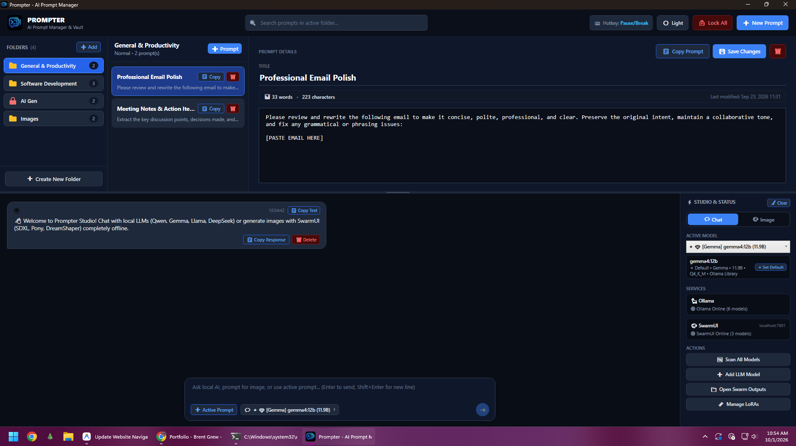
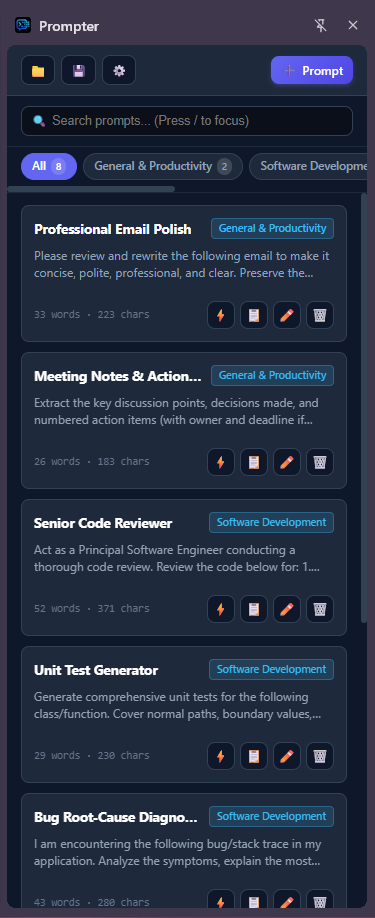

<p align="center">
  
</p>

<h1 align="center">Prompter</h1>

<p align="center">
  <strong>The Ultimate AI Prompt Studio, Local LLM Chat & SwarmUI Diffusion Hub</strong><br>
  <em>Encrypted Prompt Vault · Local Ollama Streaming · SwarmUI LoRA Studio · Chrome Extension Side Panel</em>
</p>

<p align="center">
  
  
  
  
  
  
</p>

---

## 📖 Overview

**Prompter** is a dual-interface AI powerhouse designed for power users, prompt engineers, and AI artists:

1. **Prompter Desktop**: A native, high-performance Windows WPF application (.NET 10) combining an encrypted prompt vault with local LLM streaming (**Ollama**) and a full diffusion image generation studio (**SwarmUI** / ComfyUI) with smart LoRA architecture detection.
2. **Prompter for Chrome**: A companion Manifest V3 browser extension available as both a persistent **Side Panel** (`Ctrl+Shift+O`) and quick **Popup** (`Ctrl+Shift+P`), offering 1-click prompt insertion into ChatGPT, Claude, Gemini, Midjourney, and any web textarea.

Both interfaces share seamless, 100% compatible JSON vault backup and synchronization (`prompter_vault.json`).

---

## 📸 Screenshots

<table align="center">
  <tr>
    <td align="center" width="70%">
      <strong>Prompter Desktop (Windows WPF · .NET 10)</strong><br><br>
      
    </td>
    <td align="center" width="30%">
      <strong>Prompter Chrome Extension (Side Panel)</strong><br><br>
      
    </td>
  </tr>
</table>

---

## 🌟 Core Features

### 🗄️ 1. Encrypted Prompt Vault & Management
- **Categorized Folder Hierarchy**: Organize prompts into customizable folders (*Coding*, *Creative Writing*, *Diffusion Photography*, *Productivity*, etc.).
- **Military-Grade AES-256-GCM Encryption**: Password-protect sensitive prompt folders with PBKDF2 key derivation (SHA-256, 100,000 iterations). Encrypted folders remain strictly ciphertext on disk and in memory until unlocked with your master passphrase.
- **One-Click Actions**:
  - `📋 Copy`: Fast clipboard copy with subtle toast confirmation.
  - `✏️ Edit`: In-place editing of title, folder, and prompt text.
  - `🗑️ Delete`: Safe deletion with confirmation safeguards.
- **Instant Search**: Real-time filtering across titles and prompt bodies (press `/` to instantly focus search).
- **Portable JSON Vault**: Export and import your entire collection (`prompter_vault.json`) with merge or replace options—fully interoperable between the Windows app and the Chrome extension.

---

### 💬 2. Local AI Chat Studio (Ollama)
- **Multi-Model Streaming**: Chat natively with local LLMs including **Qwen**, **DeepSeek**, **Llama 3**, **Gemma 2**, **Mistral**, **Phi**, and more.
- **Reasoning Process Accordion**: Automatic thought-process folding for reasoning models (DeepSeek-R1, QwQ) keeping chats clean while preserving transparency.
- **Smooth Physical Pixel Scrolling**: Eliminates jarring listview virtualization jumps during rapid token streaming.
- **Automatic Daemon Discovery**: Auto-detects local Ollama API instances (`http://localhost:11434`) and installed model tags without configuration.

---

### 🎨 3. SwarmUI Image Studio & Advanced LoRA Engine
- **Direct SwarmUI REST API Integration**: Communicates via standard SwarmUI API (`http://localhost:7801`) without altering ComfyUI workflows or SwarmUI installations.
- **Dynamic Checkpoint Discovery**: Auto-detects Stable Diffusion checkpoints (**SDXL 1.0**, **SD 1.5**, **Pony**, **DreamShaper**, etc.) directly from disk (`X:\SwarmUI\Models\Stable-Diffusion`) and API endpoints.
- **Intelligent Video Filtering**: Automatically identifies and filters out video-only diffusion models (e.g., Wan) from image checkpoint selectors.
- **Binary Safetensors LoRA Architecture Detection**:
  - Automatically inspects safetensors binary headers on disk to accurately detect base architectures (`SDXL`, `SD 1.5`, or `Wan`).
  - Evaluates `ss_base_model_version`, `modelspec.architecture`, `modelspec.resolution`, and internal tensor key dimensions.
  - **Compatibility Filtering**: Selecting an SDXL model only shows verified SDXL LoRAs; selecting an SD 1.5 model only shows SD 1.5 LoRAs.
- **NSFW Folder Password Lock**:
  - Subfolders designated as NSFW in `X:\SwarmUI\Models\Lora` are protected by a password lock.
  - Keeps adult or sensitive LoRAs hidden from model lists until authenticated with a session password.
- **Interactive LoRA Weight Tuning**: Adjust LoRA influence sliders from 0.1 to 2.0 (default: 1.0) with automated SwarmUI syntax injection (`<lora:filename:weight>`).
- **Seed Controls & Compact Previews**:
  - 1/2 size compact preview grid in image generation tabs for efficient visual browsing.
  - Seed viewer and manual seed input box.
  - One-click **Random Seed** toggle (`-1`).
- **Complete Image Management**:
  - Full-resolution preview modal with pan and zoom.
  - `🔄 Regenerate`: Re-execute generation with the exact prompt and settings.
  - `📁 Open in Folder`: Instant file selection in Windows Explorer.
  - `📋 Copy Image`: Copy image bitmap directly to clipboard.
  - `🗑️ Delete`: Remove image from disk and chat history.
- **Safe & Non-Intrusive**: Prompter never auto-launches heavy diffusion models or background servers on startup; includes a manual "Start SwarmUI" trigger.

---

### 🌐 4. Prompter for Google Chrome (Extension)
- **Manifest V3 Architecture**: Modern, lightweight, and performant browser extension.
- **Persistent Side Panel (`Ctrl+Shift+O`)**: Keep Prompter open right next to your active web tabs in Chrome's native Side Panel.
- **Quick Popup (`Ctrl+Shift+P`)**: Fast toolbar popup for quick search and copy.
- **1-Click Direct Page Insertion**:
  - Injects prompts directly into active web textboxes (ChatGPT, Claude, Gemini, SwarmUI Web, Midjourney, etc.).
  - **Deep Shadow DOM Piercing**: Pierces custom elements like `<rich-textarea>` and nested shadow roots on modern AI web clients.
  - Auto-focuses target inputs, sets native input values, and triggers `input`/`change` events for seamless framework reactivity.
  - Automatic fallback to clipboard copy when no web tab or text input is active.
- **Appearance & Color Themes**:
  - Toggle between **🌙 Dark Theme** (sleek slate appearance, default) and **☀️ Light Theme**.
  - Synchronizes theme instantly across Popup and Side Panel views.
- **Uniform Action Controls**: Clean 28×28px icon buttons (`⚡` Insert, `📋` Copy, `✏️` Edit, `🗑️` Delete) with distinct hover tints.
- **Quick Prefix Cleaner**: Strip leading `"Prompt:"`, quotation marks, and markdown code fences with a single click.

---

### 🪟 5. Window Behavior & System Tray
- **Minimize Button `[-]`**: Minimizes Prompter directly to the Windows Taskbar for normal workflow switching.
- **Close Button `[X]`**: Hides Prompter cleanly into the Windows System Tray (notification area).
- **Global `Pause/Break` Summoning**:
  - Press `Pause/Break` from **any window or game** in Windows to instantly summon Prompter to the foreground.
  - Press `Pause/Break` again while Prompter is open to hide it straight back to the System Tray.
  - Works reliably even when chat inputs or search boxes are actively focused.
- **Single-Instance Mutex**: Prevents multiple instances from running simultaneously; automatically activates and restores the running instance.

---

## ⌨️ Shortcuts & Hotkeys

### Windows Desktop App
| Hotkey / Control | Action |
|---|---|
| `Pause/Break` | Globally toggle Prompter (Show / Hide to System Tray) |
| `/` | Focus search bar immediately |
| `Enter` | Send chat prompt or trigger image generation |
| `Shift + Enter` | Insert newline in prompt textarea |
| `Escape` | Close active dialog or clear selection |
| `Minimize [_]` | Minimize window to Windows Taskbar |
| `Close [X]` | Hide window to Windows System Tray |
| `Tray Icon Click` | Show / restore Prompter window |

### Chrome Extension
| Hotkey | Action |
|---|---|
| `Ctrl + Shift + O` (`Cmd + Shift + O` on Mac) | Open / toggle Prompter in Chrome Side Panel |
| `Ctrl + Shift + P` (`Cmd + Shift + P` on Mac) | Open Prompter Popup |
| `/` | Focus extension search bar |
| `Escape` | Clear search or close open modal |

---

## 🛠️ Tech Stack & Architecture

```
Prompter/
├── MainWindow.xaml / .cs           # Primary WPF application window & view logic
├── Models/
│   ├── PromptItem.cs              # Prompt entity with folder association
│   ├── PromptFolder.cs            # Vault folder with encryption metadata
│   ├── PromptVault.cs             # Full vault serialization structure
│   ├── ChatMessage.cs             # Chat message model with reasoning & image metadata
│   └── LoraModelInfo.cs           # LoRA model details, weights & architecture flags
├── Services/
│   ├── VaultService.cs            # AES-256-GCM / PBKDF2 encryption & storage engine
│   ├── OllamaService.cs           # Streaming Ollama REST API client
│   ├── SwarmUiService.cs          # SwarmUI REST API client & Safetensors binary parser
│   ├── HotkeyService.cs           # Win32 RegisterHotKey global hook (Pause/Break)
│   ├── SystemTrayService.cs       # Win32 Shell_NotifyIcon system tray manager
│   └── ProcessHelper.cs           # Safe external process launchers (SwarmUI / Ollama)
├── Tests/
│   └── CoreTests.cs               # 61 Automated unit tests (MSTest)
└── extension/
    ├── manifest.json              # Chrome Extension Manifest V3 configuration
    ├── sidepanel.html / popup.html# Side Panel and Popup views
    ├── app.js / app.css           # UI controller, theme manager & event handlers
    ├── injector.js                # Deep Shadow DOM page injection script
    ├── storage.js                 # Chrome local storage & vault JSON synchronization
    ├── crypto.js                  # Web Crypto API AES-GCM password protection
    └── background.js              # Service worker handling side panel lifecycle
```

- **Runtime**: .NET 10.0 (Windows Desktop SDK)
- **Language**: C# 13.0
- **Cryptography**: AES-256-GCM (Authenticated Encryption with Associated Data), PBKDF2 SHA-256 (100,000 iterations)
- **Extension**: Google Chrome Manifest V3, Web Crypto API, Shadow DOM v1

---

## 🚀 Getting Started

### Prerequisites
- **Operating System**: Windows 10 (Build 19041+) or Windows 11 (64-bit)
- **Runtime**: [.NET 10.0 Desktop Runtime](https://dotnet.microsoft.com/download/dotnet/10.0)
- *(Optional for Local Chat)*: [Ollama](https://ollama.com/)
- *(Optional for Image Studio)*: [SwarmUI](https://github.com/mcmonkeyprojects/SwarmUI)

---

### Building Prompter Desktop from Source

```powershell
# 1. Clone the repository
git clone https://github.com/brentgrew/Prompter.git
cd Prompter

# 2. Run automated test suite (all 61 tests must pass)
dotnet test Tests\Prompter.Tests.csproj -c Release

# 3. Build & Run Desktop Application
dotnet run -c Release
```

#### Standalone Published Release
To compile a self-contained release binary:
```powershell
dotnet publish Prompter.csproj -c Release -r win-x64 --self-contained false -o bin\Publish
```
The compiled executable will be located at `bin\Publish\Prompter.exe`.

---

### Installing Prompter for Google Chrome

1. Open **Google Chrome** and navigate to `chrome://extensions/`.
2. Enable **Developer mode** using the toggle in the top-right corner.
3. Click the **Load unpacked** button in the top-left corner.
4. Select the `extension` folder located inside the cloned `Prompter` directory:
   ```
   C:\path\to\Prompter\extension
   ```
5. Click the Extensions (puzzle piece) icon in your Chrome toolbar and **Pin** 📌 Prompter for easy access.
6. Press `Ctrl+Shift+O` to open Prompter in the Chrome Side Panel alongside your favorite AI web tools!

---

## 🔒 Security & Privacy

- **100% Local Execution**: Prompter does not connect to any proprietary cloud servers, analytics trackers, or third-party telemetry.
- **Zero-Knowledge Encryption**: Encrypted prompt folders are secured using AES-256-GCM. Passphrases are never stored; if a folder password is lost, data cannot be recovered.
- **Strict Network Scope**:
  - Desktop connects solely to your local loopback interfaces (`localhost:11434` for Ollama, `localhost:7801` for SwarmUI).
  - Chrome extension interacts only with your active web tab upon your explicit command (`⚡ Insert`).

---

## 🧪 Automated Testing

Prompter maintains a comprehensive unit test suite covering cryptography, vault serialization, Safetensors binary header detection, LoRA compatibility matching, and SwarmUI integration:

```powershell
dotnet test Tests\Prompter.Tests.csproj
```

```
Test run for Prompter.Tests.dll (.NETCoreApp,Version=v10.0)
Passed!  - Failed: 0, Passed: 61, Skipped: 0, Total: 61
```

---

## 📄 License

This project is licensed under the [MIT License](LICENSE) — free for personal and commercial use.
